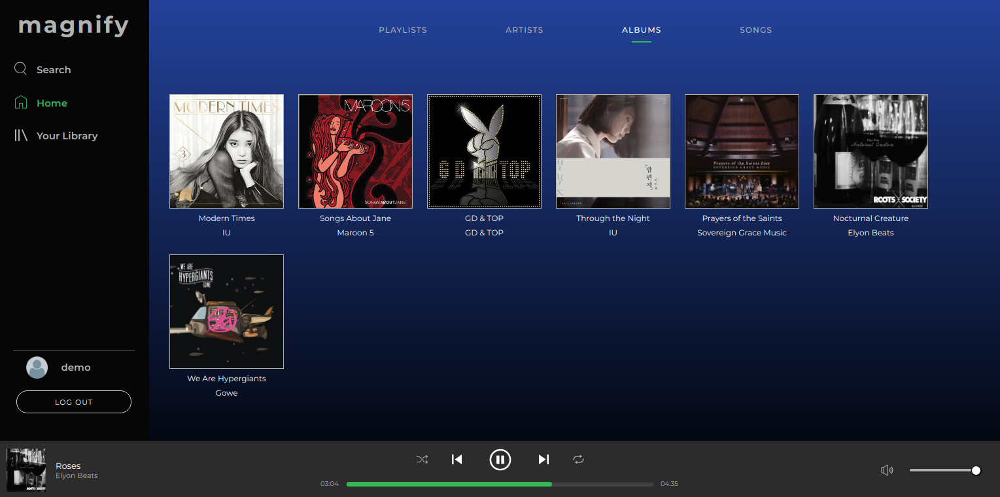

# Magnify

[Magnify](https://magnify-.herokuapp.com/#/) is inspired from Spotify - it allows users to continuously listen to songs across pages, search for artists and albums, save media to their library, follow users, and create playlists.

## Technology
* Ruby on Rails backend, with data stored using PostgreSQL
* React and Redux frontend, for a single-page app
* Images and audio files stored using ActiveStorage / AWS S3

## Key Features

### Continuous Playback
Magnify continuously plays songs without interruption as the user navigates the site.

### Responsive Search
Users are able to search for their favorite artists, albums, songs, and playlists. Search results are updated as each letter is typed.

## Future Plans
* Allowing the user to go to previous and next songs
* Implementation of a queue of songs
* Featured songs (new releases, customized mixes)
* Uploading photos for user avatars
