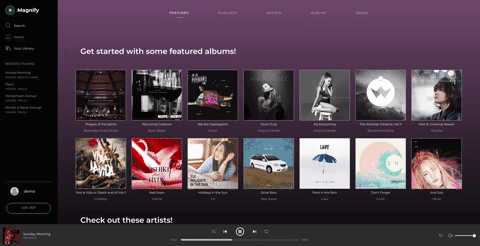
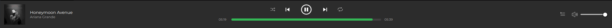

# Magnify

[Magnify](https://magnify-.herokuapp.com/#/) is inspired by Spotify - it allows users to continuously listen to songs across pages, search for artists and albums, save media to their library, follow users, and create playlists.




## Technology
* Ruby on Rails backend, with data stored using PostgreSQL
* React and Redux frontend, for a single-page app
* Images and audio files stored using ActiveStorage / AWS S3

## Key Features

### Creating and Updating Playlists
Imitating Spotify, the user interacts with intuitive drop-down menus and modal windows to create and add songs to their playlists.


### Continuous Playback
The music player appears as long as the user is logged in, and it continuously plays songs in queue without interruption as the user navigates the site.



This functionality was achieved by having the music player component interact with its corresponding Redux slice of state containing the songs to play. Upon clicking on any song, the state is updated with the song's information and is sent to the audio player.

Music player related events, such as pausing the song and updating the progress bar, are controlled using a reference to the audio HTML element and calling the relevant methods (ex. play, pause, duration).

```javascript
play () {
  let player = this.refs.player;
  const action = player.paused || player.ended ? "play" : "pause";
  player[action]();
  this.changeButton(action);
}
```

### Search
Users are able to search for their favorite artists, albums, songs, and playlists. Search results are updated as each letter is typed.


The results are divided into indices for artists, albums, playlists, and songs. As the user types into the search bar, the search component updates the url path with the user input. The media index components (when rendered on the search route) are set up to then fetch and filter the relevant data.

## Future Plans
* Featured songs (new releases, customized mixes)
* Uploading photos for user avatars
* Responsiveness to mobile devices
